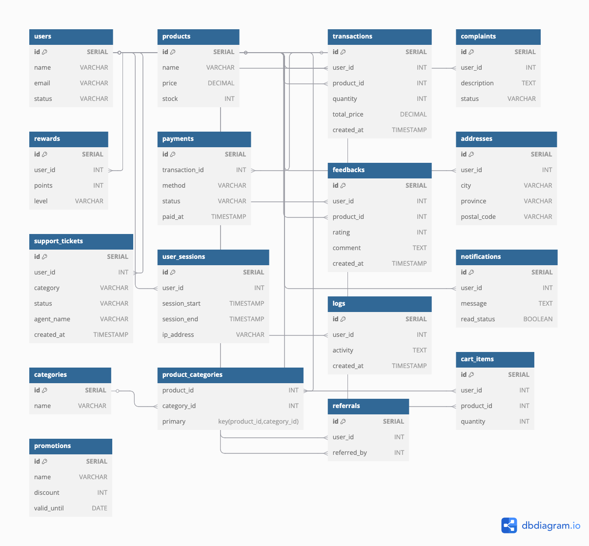

# 🛒 QA E-Commerce Database Project


A comprehensive SQL project simulating real-world QA practices on an e-commerce database system.
It includes schema validation, structured queries, and business insights to demonstrate data quality assurance skills in SQL-based environments.

---

## 🧱 ERD (Entity Relationship Diagram)



---

## 📂 Project Structure

- `schema/` – PostgreSQL DDL scripts to create tables
- `data/` – SQL dump from pgAdmin containing schema + data
- `queries/` – Analytical and monitoring SQL scripts
- `test_cases/` – Positive and negative test SQLs for QA validation
- `screenshots/` – Visual proof of real PostgreSQL query execution

---

## 📊 Query Sets

Structured SQL categorized by purpose to simulate QA and analytical tasks:

### 📈 analytics/
- `total_sales_per_month.sql`: Monthly transaction count and revenue
- `top_selling_products.sql`: Most frequently purchased products

### 👤 user_behavior/
- `most_loyal_customers.sql`: Customers with the most transactions
- `unread_notifications.sql`: List of unread user notifications

### 🛠️ admin_monitoring/
- `slow_response_tickets.sql`: Support tickets still open after 3 days

---

## ✅ Test Cases

The `/test_cases/` folder contains **17 SQL scripts** for both positive and negative testing across:

- NULL & integrity constraint violations
- Orphaned records (foreign key mismatches)
- Business logic compliance
- Validity check for existing rows

---

## 🚀 Getting Started

You can run the schema and dummy data in your SQL environment:

```bash
psql -U postgres -d ecommerce_db -f data/qa_ecommerce_backup.sql
```

Then explore and test the data using the queries inside the `/queries/` and `/test_cases/` folders.

---

## 🖼️ Screenshots

Query: Top 5 Most Sold Products  


---

## 📈 Project Scope

This project demonstrates:

- Relational database design with realistic e-commerce entities
- QA test planning via query-based validation
- Analytical SQL querying (user behavior, admin monitoring, etc.)
- Git-based version control and documentation for technical portfolios

---

## 🌟 Why This Project?

This repository was built to showcase my ability to:

- Write efficient SQL for both QA and analytics
- Design test cases to validate data quality and integrity
- Simulate real-world data scenarios using dummy data
- Communicate clearly through structured documentation

---

## 🙋‍♀️ Author

Project by **Nur Asiyah** — for portfolio and educational purposes only.  
📧 Email: asiyah.contact@gmail.com  
🔗 [LinkedIn](https://www.linkedin.com/in/asiyah-n-515550186/)
